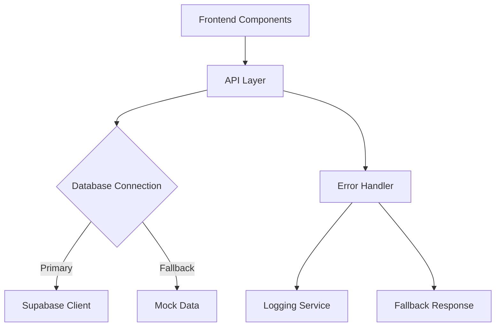

# Design Document

## Overview

This design document outlines the technical approach to fix three critical frontend issues in the EggyPro ecommerce store: individual product page 404 errors, search API 500 errors, and stats API 500 errors. The solution focuses on robust error handling, proper Supabase query implementation, and graceful fallback mechanisms to ensure a reliable user experience.

## Architecture

### Current System Analysis

The current implementation has several architectural issues:

1. **Mixed Database Approaches**: The codebase uses both Drizzle ORM and direct Supabase client calls, creating inconsistency
2. **Insufficient Error Handling**: API endpoints lack comprehensive error handling and fallback mechanisms  
3. **Client-Side Data Fetching**: Product pages rely on client-side API calls that can fail silently
4. **Query Complexity**: Stats API attempts complex aggregations that may not be properly supported

### Proposed Architecture



## Components and Interfaces

### 1. Enhanced API Error Handling

#### Error Response Interface
```typescript
interface ApiErrorResponse {
  error: string;
  details?: string;
  fallback?: boolean;
  timestamp: string;
}

interface ApiSuccessResponse<T> {
  data: T;
  meta?: {
    total?: number;
    query?: Record<string, any>;
  };
}
```

#### Error Handler Utility
```typescript
class ApiErrorHandler {
  static handleDatabaseError(error: any, fallbackData?: any): Response;
  static logError(context: string, error: any): void;
  static createErrorResponse(message: string, status: number, details?: string): Response;
}
```

### 2. Product Page Fix

#### Enhanced Product Fetching
```typescript
interface ProductPageData {
  product: ApiProduct;
  reviews: Review[];
  relatedProducts: Product[];
  fallbackUsed: boolean;
}

class ProductService {
  static async getProductBySlug(slug: string): Promise<ProductPageData>;
  static async getRelatedProducts(productId: number, limit: number): Promise<Product[]>;
}
```

#### Route Handler Enhancement
- Implement proper parameter validation
- Add comprehensive error logging
- Provide fallback to mock data when Supabase fails
- Return structured error responses

### 3. Search API Fix

#### Search Query Builder
```typescript
interface SearchParams {
  query?: string;
  minPrice?: number;
  maxPrice?: number;
  sort?: 'price-asc' | 'price-desc' | 'name-asc' | 'stock-desc' | 'newest';
  inStock?: boolean;
  limit?: number;
  offset?: number;
}

interface SearchResponse {
  products: Product[];
  total: number;
  query: SearchParams;
  fallbackUsed: boolean;
}

class SearchService {
  static async searchProducts(params: SearchParams): Promise<SearchResponse>;
  static buildSupabaseQuery(params: SearchParams): SupabaseQueryBuilder;
  static validateSearchParams(params: SearchParams): SearchParams;
}
```

#### Query Optimization
- Implement parameter sanitization
- Add query validation and error handling
- Provide fallback search using mock data
- Optimize Supabase query construction

### 4. Stats API Fix

#### Statistics Interface
```typescript
interface ProductStats {
  totalProducts: number;
  totalStock: number;
  totalReviews: number;
  averageRating: string;
  lowStockProducts: Product[];
  summary: {
    inStock: number;
    outOfStock: number;
    lowStock: number;
  };
  fallbackUsed: boolean;
}

class StatsService {
  static async getProductStats(): Promise<ProductStats>;
  static async getTotalProducts(): Promise<number>;
  static async getTotalStock(): Promise<number>;
  static async getReviewStats(): Promise<{ total: number; average: number }>;
  static async getLowStockProducts(): Promise<Product[]>;
}
```

#### Aggregation Strategy
- Break down complex queries into individual operations
- Implement individual try/catch blocks for each statistic
- Provide fallback values for failed calculations
- Use Supabase's built-in aggregation functions properly

## Data Models

### Enhanced Product Model
```typescript
interface Product {
  id: number;
  name: string;
  slug: string;
  description: string;
  price: string;
  stock_quantity: number;
  images: string[];
  ingredients: string[];
  details: string;
  is_active: boolean;
  created_at: string;
  updated_at: string;
}

interface ApiProduct extends Product {
  reviews: Review[];
  averageRating?: number;
  reviewCount?: number;
}
```

### Error Tracking Model
```typescript
interface ErrorLog {
  timestamp: string;
  endpoint: string;
  error: string;
  details?: any;
  userAgent?: string;
  ip?: string;
}
```

## Error Handling

### Three-Tier Error Handling Strategy

#### Tier 1: Database Level
- Catch Supabase connection errors
- Implement connection retry logic
- Fallback to mock data when database is unavailable

#### Tier 2: API Level
- Validate all input parameters
- Implement comprehensive error logging
- Return structured error responses
- Provide meaningful error messages

#### Tier 3: Frontend Level
- Implement error boundaries for React components
- Display user-friendly error messages
- Provide retry mechanisms for failed requests
- Show loading states during operations

### Error Response Standards
```typescript
// Success Response
{
  data: T,
  meta?: {
    total?: number,
    query?: Record<string, any>
  }
}

// Error Response
{
  error: "User-friendly error message",
  details?: "Technical error details",
  fallback?: true, // If fallback data was used
  timestamp: "2025-07-17T12:00:00Z"
}
```

## Testing Strategy

### Unit Testing
- Test individual API endpoints with various input scenarios
- Test error handling with simulated database failures
- Test parameter validation and sanitization
- Test fallback mechanisms

### Integration Testing
- Test complete user flows from frontend to database
- Test error propagation through the system
- Test fallback data consistency
- Test performance under load

### Error Scenario Testing
- Database connection failures
- Invalid parameter inputs
- Network timeouts
- Malformed requests
- Edge cases (empty results, null values)

### Test Data Requirements
```typescript
const testScenarios = {
  productPage: {
    validSlugs: ['eggypro-original', 'eggypro-vanilla-dream'],
    invalidSlugs: ['non-existent', 'invalid-slug'],
    edgeCases: ['', null, undefined]
  },
  search: {
    validQueries: ['egg', 'protein', 'vanilla'],
    priceRanges: [{ min: 0, max: 50 }, { min: 30, max: 40 }],
    sortOptions: ['price-asc', 'price-desc', 'name-asc'],
    invalidInputs: [{ minPrice: 'invalid' }, { sort: 'invalid-sort' }]
  },
  stats: {
    expectedMetrics: ['totalProducts', 'totalStock', 'averageRating'],
    fallbackValues: { totalProducts: 0, totalStock: 0, averageRating: '0.0' }
  }
};
```

## Implementation Approach

### Phase 1: Infrastructure Setup
1. Create error handling utilities
2. Implement logging service
3. Set up fallback data mechanisms
4. Create standardized response formats

### Phase 2: API Endpoint Fixes
1. Fix individual product API endpoint
2. Fix search API endpoint  
3. Fix stats API endpoint
4. Implement comprehensive error handling

### Phase 3: Frontend Integration
1. Update product page component
2. Implement error boundaries
3. Add loading states and user feedback
4. Test complete user flows

### Phase 4: Testing and Validation
1. Comprehensive testing of all endpoints
2. Error scenario validation
3. Performance testing
4. User acceptance testing

## Security Considerations

### Input Validation
- Sanitize all search parameters
- Validate slug parameters for path traversal
- Implement rate limiting for search endpoints
- Prevent SQL injection through proper parameterization

### Error Information Disclosure
- Avoid exposing sensitive database information in error messages
- Log detailed errors server-side only
- Return generic error messages to clients
- Implement proper error categorization

## Performance Optimization

### Database Query Optimization
- Use appropriate indexes for search queries
- Implement query result caching where appropriate
- Optimize aggregation queries for stats
- Use connection pooling for database connections

### Response Optimization
- Implement response compression
- Use appropriate HTTP caching headers
- Minimize response payload size
- Implement pagination for large result sets

## Monitoring and Observability

### Logging Strategy
- Log all API errors with context
- Track response times and performance metrics
- Monitor database connection health
- Track fallback usage frequency

### Health Checks
- Implement endpoint health checks
- Monitor database connectivity
- Track error rates and patterns
- Set up alerting for critical failures

## Conclusion

This design provides a comprehensive solution to fix the critical frontend issues while establishing a robust foundation for future development. The three-tier error handling approach ensures graceful degradation, while the fallback mechanisms maintain functionality even during database issues. The implementation prioritizes user experience, system reliability, and maintainability.