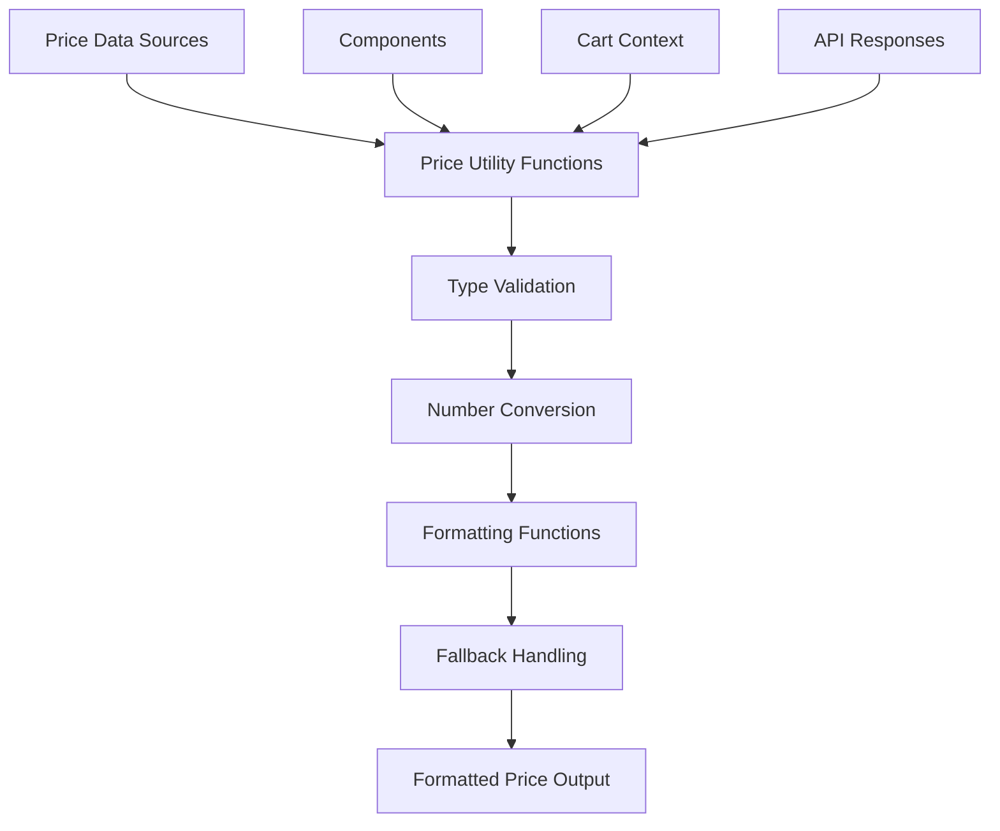

# Design Document

## Overview

This design document outlines the technical solution to fix the price formatting bug where `toFixed is not a function` errors occur due to inconsistent price data types throughout the EggyPro ecommerce application. The solution implements a centralized price handling utility that ensures type safety and consistent formatting across all price-related operations.

## Architecture

### Current Problem Analysis

The current implementation has several issues:

1. **Mixed Data Types**: Prices are stored as strings in the database but treated as numbers in calculations
2. **Direct Method Calls**: Code directly calls `.toFixed()` on price values without type checking
3. **Inconsistent Handling**: Different components handle price formatting differently
4. **No Fallback Mechanism**: When price formatting fails, the entire component crashes

### Proposed Architecture



## Components and Interfaces

### 1. Price Utility Functions

#### Core Price Interface
```typescript
interface PriceValue {
  raw: string | number;
  numeric: number;
  formatted: string;
  isValid: boolean;
}

interface PriceFormatOptions {
  currency?: string;
  locale?: string;
  minimumFractionDigits?: number;
  maximumFractionDigits?: number;
  fallbackText?: string;
}
```

#### Price Utility Class
```typescript
class PriceUtils {
  static formatPrice(price: string | number, options?: PriceFormatOptions): string;
  static parsePrice(price: string | number): PriceValue;
  static calculateTotal(items: Array<{price: string | number, quantity: number}>): PriceValue;
  static isValidPrice(price: any): boolean;
  static getNumericPrice(price: string | number): number;
  static formatCurrency(amount: number, options?: PriceFormatOptions): string;
}
```

### 2. Enhanced Cart Context

#### Cart Item Interface
```typescript
interface CartItem {
  id: number;
  name: string;
  price: string | number; // Accept both types
  quantity: number;
  image?: string;
}

interface CartContextValue {
  items: CartItem[];
  total: PriceValue;
  addItem: (item: Omit<CartItem, 'quantity'>) => void;
  updateQuantity: (id: number, quantity: number) => void;
  removeItem: (id: number) => void;
  clearCart: () => void;
}
```

### 3. Component Price Handling

#### Product Card Component
```typescript
interface ProductCardProps {
  product: {
    id: number;
    name: string;
    price: string | number;
    image?: string;
  };
}

// Usage in component:
const formattedPrice = PriceUtils.formatPrice(product.price);
```

#### Cart Display Component
```typescript
interface CartDisplayProps {
  items: CartItem[];
  showTotal?: boolean;
}

// Safe total calculation:
const total = PriceUtils.calculateTotal(items);
```

## Data Models

### Enhanced Product Model
```typescript
interface Product {
  id: number;
  name: string;
  slug: string;
  description: string;
  price: string; // Database stores as string
  stock_quantity: number;
  // ... other fields
}

interface ProcessedProduct extends Product {
  priceValue: PriceValue; // Processed price information
}
```

### Price Validation Model
```typescript
interface PriceValidationResult {
  isValid: boolean;
  numericValue: number;
  originalValue: string | number;
  error?: string;
}
```

## Error Handling

### Three-Layer Error Handling

#### Layer 1: Input Validation
```typescript
function validatePriceInput(price: any): PriceValidationResult {
  if (price === null || price === undefined) {
    return { isValid: false, numericValue: 0, originalValue: price, error: 'Price is null or undefined' };
  }
  
  if (typeof price === 'number' && !isNaN(price)) {
    return { isValid: true, numericValue: price, originalValue: price };
  }
  
  if (typeof price === 'string') {
    const parsed = parseFloat(price);
    if (!isNaN(parsed)) {
      return { isValid: true, numericValue: parsed, originalValue: price };
    }
  }
  
  return { isValid: false, numericValue: 0, originalValue: price, error: 'Invalid price format' };
}
```

#### Layer 2: Safe Formatting
```typescript
function safeFormatPrice(price: string | number, options: PriceFormatOptions = {}): string {
  const validation = validatePriceInput(price);
  
  if (!validation.isValid) {
    console.warn(`Invalid price value: ${price}`, validation.error);
    return options.fallbackText || '$0.00';
  }
  
  try {
    return formatCurrency(validation.numericValue, options);
  } catch (error) {
    console.error('Price formatting error:', error);
    return options.fallbackText || '$0.00';
  }
}
```

#### Layer 3: Component Error Boundaries
```typescript
function PriceDisplay({ price, ...options }: { price: string | number } & PriceFormatOptions) {
  try {
    const formattedPrice = PriceUtils.formatPrice(price, options);
    return <span className="price">{formattedPrice}</span>;
  } catch (error) {
    console.error('Price display error:', error);
    return <span className="price error">Price unavailable</span>;
  }
}
```

## Testing Strategy

### Unit Testing
```typescript
describe('PriceUtils', () => {
  describe('formatPrice', () => {
    it('should format numeric prices correctly', () => {
      expect(PriceUtils.formatPrice(29.99)).toBe('$29.99');
    });
    
    it('should format string prices correctly', () => {
      expect(PriceUtils.formatPrice('29.99')).toBe('$29.99');
    });
    
    it('should handle invalid prices gracefully', () => {
      expect(PriceUtils.formatPrice('invalid')).toBe('$0.00');
    });
    
    it('should handle null/undefined prices', () => {
      expect(PriceUtils.formatPrice(null)).toBe('$0.00');
      expect(PriceUtils.formatPrice(undefined)).toBe('$0.00');
    });
  });
  
  describe('calculateTotal', () => {
    it('should calculate totals with mixed price types', () => {
      const items = [
        { price: '29.99', quantity: 2 },
        { price: 15.50, quantity: 1 }
      ];
      const total = PriceUtils.calculateTotal(items);
      expect(total.numeric).toBe(75.48);
    });
  });
});
```

### Integration Testing
- Test cart functionality with mixed price types
- Test checkout flow with price calculations
- Test product display components with various price formats
- Test error scenarios and fallback behavior

## Implementation Approach

### Phase 1: Core Utility Implementation
1. Create `src/lib/price-utils.ts` with core price handling functions
2. Implement comprehensive type validation and conversion
3. Add error handling and fallback mechanisms
4. Create unit tests for all utility functions

### Phase 2: Cart Context Update
1. Update cart context to use price utilities
2. Ensure all cart calculations use numeric values
3. Add proper error handling for cart operations
4. Test cart functionality with various price formats

### Phase 3: Component Updates
1. Update ProductCard component to use price utilities
2. Update cart display components
3. Update checkout components
4. Add error boundaries for price-related components

### Phase 4: API and Data Layer
1. Ensure API responses handle price formatting consistently
2. Add price validation to data fetching functions
3. Update any server-side price calculations
4. Test end-to-end price handling

## Security Considerations

### Input Sanitization
- Validate all price inputs to prevent injection attacks
- Sanitize price strings before parsing
- Implement bounds checking for price values
- Prevent negative prices where inappropriate

### Data Integrity
- Ensure price calculations maintain precision
- Validate price totals against expected ranges
- Log suspicious price modifications
- Implement audit trails for price changes

## Performance Optimization

### Caching Strategy
- Cache formatted price strings for repeated use
- Memoize expensive price calculations
- Use React.memo for price display components
- Implement efficient cart total recalculation

### Memory Management
- Avoid creating unnecessary price objects
- Clean up price calculation results
- Use efficient number formatting methods
- Minimize string concatenation in price formatting

## Monitoring and Observability

### Error Tracking
- Log all price formatting errors with context
- Track frequency of price validation failures
- Monitor cart calculation errors
- Alert on critical price handling failures

### Performance Monitoring
- Track price formatting performance
- Monitor cart calculation times
- Measure component render times for price displays
- Track memory usage in price-heavy operations

## Migration Strategy

### Backward Compatibility
- Maintain support for existing price formats during transition
- Implement gradual rollout of new price handling
- Provide fallback to old behavior if needed
- Document breaking changes and migration path

### Rollout Plan
1. Deploy utility functions without breaking existing code
2. Update components one by one with thorough testing
3. Monitor for any regressions or issues
4. Complete migration and remove old price handling code

## Conclusion

This design provides a comprehensive solution to fix the price formatting bug while establishing a robust foundation for consistent price handling throughout the application. The centralized utility approach ensures type safety, proper error handling, and maintainable code. The implementation prioritizes backward compatibility and gradual migration to minimize risk during deployment.