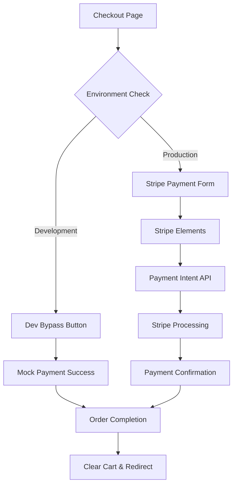

# Design Document

## Overview

This design implements Stripe payment processing integration for the existing e-commerce checkout flow. The solution replaces the current mock payment form with real Stripe payment processing while maintaining the existing cart functionality and user experience. A development bypass option is included to facilitate testing without processing real payments.

## Architecture

### High-Level Architecture



### Component Architecture

The integration will modify the existing checkout page structure:

1. **Environment Detection**: Check if running in development mode
2. **Payment Method Selection**: Show appropriate payment options based on environment
3. **Stripe Integration**: Replace mock form with Stripe Elements
4. **Order Processing**: Handle successful payments and order completion

## Components and Interfaces

### 1. Stripe Configuration

**File**: `src/lib/stripe.ts`
- Stripe client initialization
- Environment-based configuration
- Public key management

```typescript
interface StripeConfig {
  publishableKey: string;
  apiVersion: string;
}
```

### 2. Payment Intent API

**File**: `src/app/api/create-payment-intent/route.ts`
- Server-side Stripe integration
- Payment intent creation
- Amount calculation and validation

```typescript
interface PaymentIntentRequest {
  amount: number;
  currency: string;
  items: CartItem[];
}

interface PaymentIntentResponse {
  clientSecret: string;
  paymentIntentId: string;
}
```

### 3. Enhanced Checkout Page

**File**: `src/app/checkout/page.tsx` (modified)
- Integration with Stripe Elements
- Development bypass functionality
- Enhanced error handling and loading states

### 4. Payment Components

**File**: `src/components/payment/StripePaymentForm.tsx`
- Stripe Elements integration
- Payment form validation
- Loading and error states

**File**: `src/components/payment/DevBypassButton.tsx`
- Development-only payment bypass
- Mock success simulation

### 5. Order Confirmation

**File**: `src/components/payment/OrderConfirmation.tsx`
- Payment success display
- Order details summary
- Next steps guidance

## Data Models

### Payment Intent Data

```typescript
interface PaymentData {
  paymentIntentId: string;
  amount: number;
  currency: string;
  status: 'succeeded' | 'processing' | 'failed';
  created: number;
  items: CartItem[];
}
```

### Order Data

```typescript
interface Order {
  id: string;
  paymentIntentId?: string;
  items: CartItem[];
  totalAmount: number;
  shippingAddress: ShippingAddress;
  status: 'pending' | 'completed' | 'failed';
  createdAt: Date;
  isDevelopmentOrder?: boolean;
}
```

### Environment Configuration

```typescript
interface PaymentConfig {
  isDevelopment: boolean;
  stripePublishableKey: string;
  enableDevBypass: boolean;
}
```

## Error Handling

### Payment Errors

1. **Card Declined**: Display user-friendly message with retry option
2. **Network Errors**: Show retry mechanism with exponential backoff
3. **Validation Errors**: Real-time form validation with clear messaging
4. **Server Errors**: Graceful degradation with support contact information

### Development Errors

1. **Missing Stripe Keys**: Clear setup instructions
2. **API Failures**: Fallback to development bypass mode
3. **Configuration Issues**: Detailed error logging

### Error Recovery

- Automatic retry for transient failures
- Manual retry options for user-initiated actions
- Fallback to development bypass in development environment
- Clear error messages with actionable next steps

## Testing Strategy

### Unit Tests

1. **Stripe Configuration**: Test environment-based setup
2. **Payment Form Validation**: Test form validation logic
3. **API Endpoints**: Test payment intent creation and handling
4. **Development Bypass**: Test mock payment functionality

### Integration Tests

1. **End-to-End Payment Flow**: Test complete payment process
2. **Error Scenarios**: Test various failure modes
3. **Environment Switching**: Test development vs production behavior
4. **Cart Integration**: Test cart clearing and order completion

### Manual Testing

1. **Stripe Test Cards**: Use Stripe's test card numbers
2. **Development Bypass**: Verify bypass functionality works
3. **Error Handling**: Test various error scenarios
4. **Mobile Responsiveness**: Test on different screen sizes

### Security Testing

1. **PCI Compliance**: Ensure no sensitive data handling
2. **API Security**: Test payment intent API security
3. **Environment Variables**: Verify secure key management
4. **HTTPS Requirements**: Ensure secure connections

## Implementation Considerations

### Environment Management

- Use Next.js environment variables for Stripe keys
- Implement runtime environment detection
- Separate development and production configurations

### Performance Optimization

- Lazy load Stripe Elements
- Minimize bundle size impact
- Optimize API response times
- Implement proper loading states

### User Experience

- Maintain existing checkout flow design
- Add clear payment processing indicators
- Provide immediate feedback for all actions
- Ensure mobile-responsive design

### Security Best Practices

- Never handle raw card data
- Use Stripe Elements for PCI compliance
- Implement proper CSRF protection
- Validate all server-side inputs

### Monitoring and Logging

- Log payment attempts and outcomes
- Monitor API response times
- Track error rates and types
- Implement proper debugging for development

## Dependencies

### New Dependencies Required

```json
{
  "@stripe/stripe-js": "^2.4.0",
  "@stripe/react-stripe-js": "^2.4.0",
  "stripe": "^14.15.0"
}
```

### Environment Variables

```env
NEXT_PUBLIC_STRIPE_PUBLISHABLE_KEY=pk_test_...
STRIPE_SECRET_KEY=sk_test_...
NODE_ENV=development|production
```

## Migration Strategy

1. **Phase 1**: Add Stripe dependencies and basic configuration
2. **Phase 2**: Implement payment intent API endpoint
3. **Phase 3**: Replace checkout form with Stripe Elements
4. **Phase 4**: Add development bypass functionality
5. **Phase 5**: Implement order confirmation and cart clearing
6. **Phase 6**: Add comprehensive error handling and testing